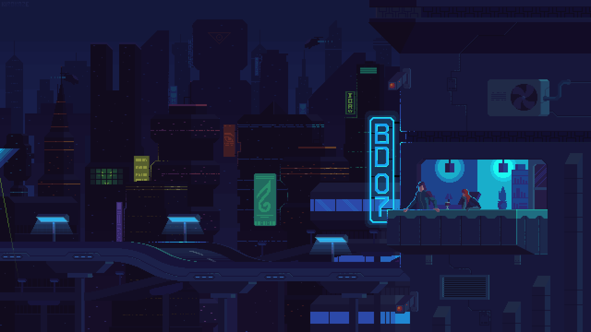
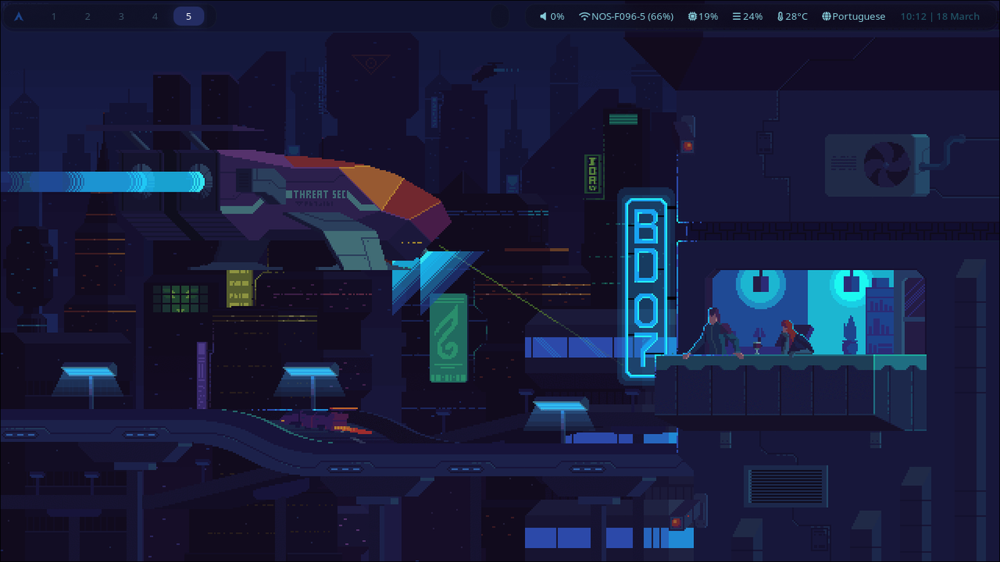

<div align="center">

# 🌆 randomdev-dotfiles-hyprland

*A cyberpunk-themed Hyprland setup by randomdevtom*



[](https://archlinux.org)
[](https://hyprland.org)
[](LICENSE)

</div>

---

## 📸 Preview

<div align="center">



</div>

---

## 🧰 Components

| Component | Package |
|---|---|
| **Compositor** | [Hyprland](https://hyprland.org) |
| **Bar** | [Waybar](https://github.com/Alexays/Waybar) |
| **Launcher** | [Hyprlauncher](https://github.com/hyprutils/hyprlauncher) + [Wofi](https://hg.sr.ht/~scoopta/wofi) |
| **Terminal** | [Kitty](https://sw.kovidgoyal.net/kitty/) |
| **Shell** | [Zsh](https://www.zsh.org) + [Oh My Zsh](https://ohmyz.sh) |
| **File Manager** | [Nemo](https://github.com/linuxmint/nemo) |
| **Notifications** | [Dunst](https://dunst-project.org) |
| **Wallpaper** | [swww](https://github.com/LGFae/swww) |
| **Color Scheme** | [pywal](https://github.com/dylanaraps/pywal) |
| **GTK Theme** | [Oomox](https://github.com/themix-project/oomox) + pywal |
| **Display Manager** | [SDDM](https://github.com/sddm/sddm) + [sddm-astronaut-theme](https://github.com/keyitdev/sddm-astronaut-theme) |
| **Browser** | [Firefox](https://www.mozilla.org/firefox) + [Pywalfox](https://github.com/Frewacom/pywalfox) |

---

## ⚡ Installation

> ⚠️ **Warning:** This script will overwrite existing config files in `~/.config`. Make sure to backup anything you want to keep before running.

> 🖥️ Designed for **Arch Linux**. Adjust drivers and packages as needed for your hardware.

### One command install

```bash
git clone https://github.com/randomdevtom/randomdev-dotfiles-hyprland.git
cd randomdev-dotfiles-hyprland
bash install.sh
```

---

## ⌨️ Keybindings

| Keybind | Action |
|---|---|
| `Super + Return` | Open terminal (Kitty) |
| `Super + D` | Open launcher (Wofi) |
| `Super + E` | Open file manager (Nemo) |
| `Super + B` | Open browser (Firefox) |
| `Super + W` | Close window |
| `Super + V` | Toggle floating |
| `Super + M` | Exit Hyprland |
| `Super + R` | Reload Waybar |
| `Super + Print` | Screenshot (copy) |
| `Shift + Super + Print` | Screenshot (save) |
| `Super + 1-0` | Switch workspace |
| `Super + Shift + 1-0` | Move window to workspace |
| `Super + S` | Toggle scratchpad |
| `Super + Arrow keys` | Move focus |

---

## 🎨 Theming

Colors are generated automatically from the wallpaper using **pywal**. The GTK theme, Waybar colors, and Hyprland border colors all update dynamically.

To change the wallpaper and regenerate colors:

```bash
./wallpaper.sh 'Path-to-your-Wallpaper'
```

---

## 📁 Structure

```
~/Dotfiles
├── .config/
│   ├── hypr/          # Hyprland config
│   ├── waybar/        # Waybar config + styles
│   ├── kitty/         # Kitty terminal config
│   ├── wal/           # Pywal templates
│   └── ...
├── .themes/           # GTK themes
├── .icons/            # Icon themes
├── Pictures/
│   └── Wallpapers/    # Wallpapers
├── .zshrc             # Zsh config
└── install.sh         # Installation script
```

---

## 🤝 Credits

- [Hyprland](https://hyprland.org) — the compositor
- [sddm-astronaut-theme](https://github.com/keyitdev/sddm-astronaut-theme) by Keyitdev
- [pywal](https://github.com/dylanaraps/pywal) by dylanaraps
- [Oomox/Themix](https://github.com/themix-project/oomox) for GTK theming

---

<div align="center">
<sub>I am a lazy guy :P</sub>
</div>
